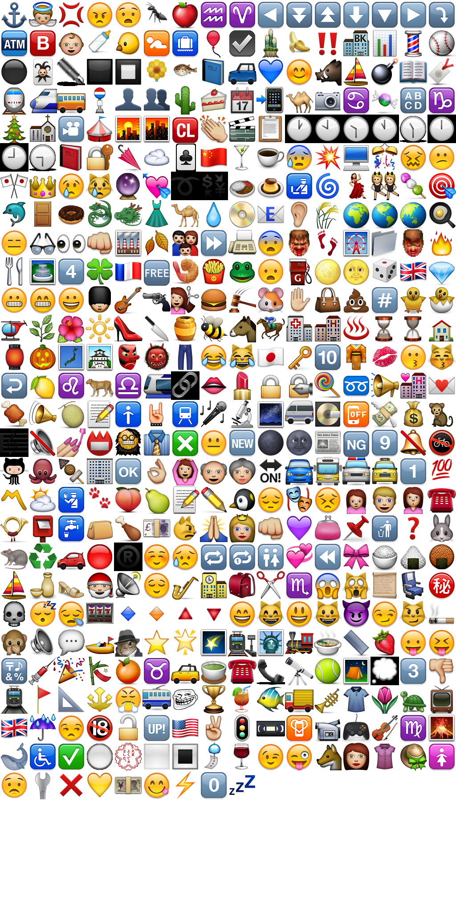

# Emojis :octocat:
- Emojis, atlased and indexed: 1024x2048 texture + json.
- Emojis, rebuild script put into public domain.

## rebuild
```
git clone https://github.com/HenrikJoreteg/emoji-images

pushd emoji-images\pngs
wget https://github.com/r-lyeh/attila/raw/master/attila.exe --no-check-certificate
attila emojis.png *.png unicode\*.png --enable-width 1024 --enable-pot > emojis.json
copy emojis.* ..\.. /y
popd
```

## links
- https://github.com/github/gemoji
- https://github.com/HenrikJoreteg/emoji-images

## preview


