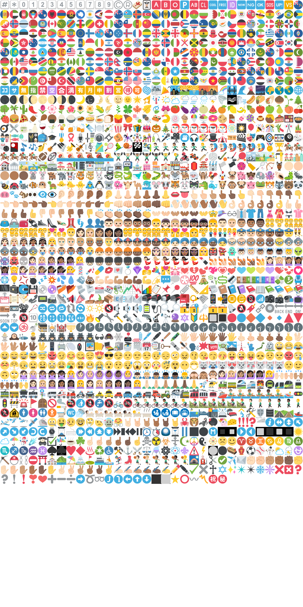

# Emojis :octocat:
- Emojis, atlased and indexed: texture + json.
- Emojis, rebuild script put into public domain.

## rebuild
```
git clone https://github.com/HenrikJoreteg/emoji-images
git clone https://github.com/Ranks/emojione

wget https://github.com/r-lyeh/attila/raw/master/attila.exe --no-check-certificate
attila apple.png emoji-images\pngs\*.png --enable-width 2048 --enable-pot > apple.json
attila emojione.png emojione\assets\png\*.png --enable-width 2048 --enable-pot > emojione.json
```

## links
- https://github.com/github/gemoji
- https://github.com/HenrikJoreteg/emoji-images
- https://github.com/Ranks/emojione

## preview



